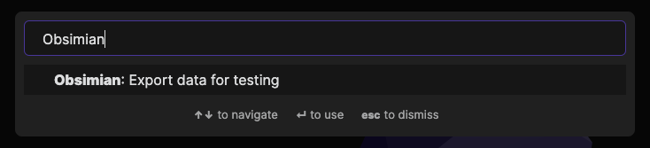

# Obsimian


Obsidian simulation framework for testing Obsidian plugins.

## Usage

If you simply want to test your plugin code against the standard Obsimian test vault:

1. Add Obsimian as a dev dependency:
   ```sh
   yarn add -D obsimian
   ```
1. In your test, create an `ObsimianPlugin` initialized with the downloaded data.
   ```ts
   describe("my plugin", () => {
     const app = new ObsimianApp(data);
     it("does the bar correctly", () => {
       expect(businessLogic.doTheBar(app)).toEqual("Bar.");
     });
   });
   ```

If you want to customize the content of the fake vault:

1. Create an Obsidian vault, or download the Obsimian test vault as a starting point.
1. Open the vault in Obsidian and modify the content to exercise the specific features of your plugin.
1. Install and enable the Obsimian plugin in Obsidian (it should be preinstalled in the test vault).
1. Run the "Obsimian: Export data for testing" command. By default, this will create a JSON file in the root of your Obsidian vault, but this can be configured in the Obsimian plugin settings.
   
1. Copy the JSON file to your project.
1. In your test, import the JSON data with `require` and pass it to the `ObsimianPlugin` constructor.

## Design

Where possible, it's good practice to decouple the code you write from the platforms and frameworks you use.

The simplest way to write an Obsidian plugin is to follow the [sample](https://github.com/obsidianmd/obsidian-sample-plugin):

```ts
export default class MyPlugin extends Plugin {
  // Dump all your business logic here.
}
```

However this is difficult to write automated tests for, since you can't actually instantiate your `MyPlugin` without an Obsidian `App`, which requires the whole Obsidian implementation. Even if this were readily available, it would be overkill for simple unit testing.

Instead, most of your plugin's business logic should be written without any knowledge of Obsidian's functionality or types. This way, each function of your business logic can be easily unit tested as it would be in any other project.

### Integration

You will ultimately need some glue code to handle communication between Obsidian and your plugin's business logic. This should be as thin as possible. For example:

```ts
import businessLogic from "./businessLogic";

class MyPlugin extends Plugin {
  settings: MyPluginSettings;

  async onload() {
    await this.loadSettings();

    this.addCommand({
      id: "my-foo",
      name: "Do the Foo",
      callback: () => {
        businessLogic.doTheFoo(this.settings.fooPath);
      },
    });
  }
}
```

You will also want some integration tests to verify that your plugin will work when it receives real commands in Obsidian. This is where **Obsimian** comes in.

If your business logic needs to interact with Obsidian's APIs (which it probably will), it should receive instances of its dependencies (e.g. `Plugin`, `App`, `Vault`) as _arguments_. This allows your tests to pass in "fake" instances of those dependencies that are lightweight and prepopulated with known data:

```ts
describe("my plugin", () => {
  const app = new ObsimianApp(data);
  it("does the bar correctly", () => {
    expect(businessLogic.doTheBar(app)).toEqual("Bar.");
  });
});
```

So long as the behavior of the fake components is sufficiently similar to the real ones, you can be confident your plugin will work in real life.

## Feedback

Realistically, there will be gaps in behavior of Obsidian and Obsimian. Obsimian is relatively new, and Obsidian is evolving relatively fast.

If you discover such a gap, please file a bug in https://github.com/motif-software/obsimian/issues. Ideally include some content and an API call that demonstrate the problem.

## Package Contents

### src/plugin

The code for the Obsimian plugin, which exports data from Obsidian APIs. If you want to customise the test vault data, install the Obsimian community plugin and run the `Export data for testing` command.

### src/fakes

The fake Obsidian components that you can use for unit testing your plugin.

### test/vault

The test vault is a real Obsidian vault with fake content crafted to expose typical edge cases in plugins.

## Development

### Testing

Testing Obsimian involves exporting data from the test vault, using it to initialize the fake components, then asserting that their APIs return the expected outputs. The tests are run with Jest:

```sh
jest --watch
```

Adding new test cases may involve adding new assertions, adding new content to the test vault, or both.

### Releasing

The `release-plugin` GitHub workflow automates the release of the plugin. When a release tag (a [semver](https://semver.org/) version string without a leading `v`) is pushed, it will bundle the Obsidian plugin `main.js` and upload it as a GitHub release.

The Obsimian fakes library is published to NPM manually. `yarn publish` builds `src/fakes/index.ts` to `index.{js,d.ts}` and publishes the package to the public NPM registry.
